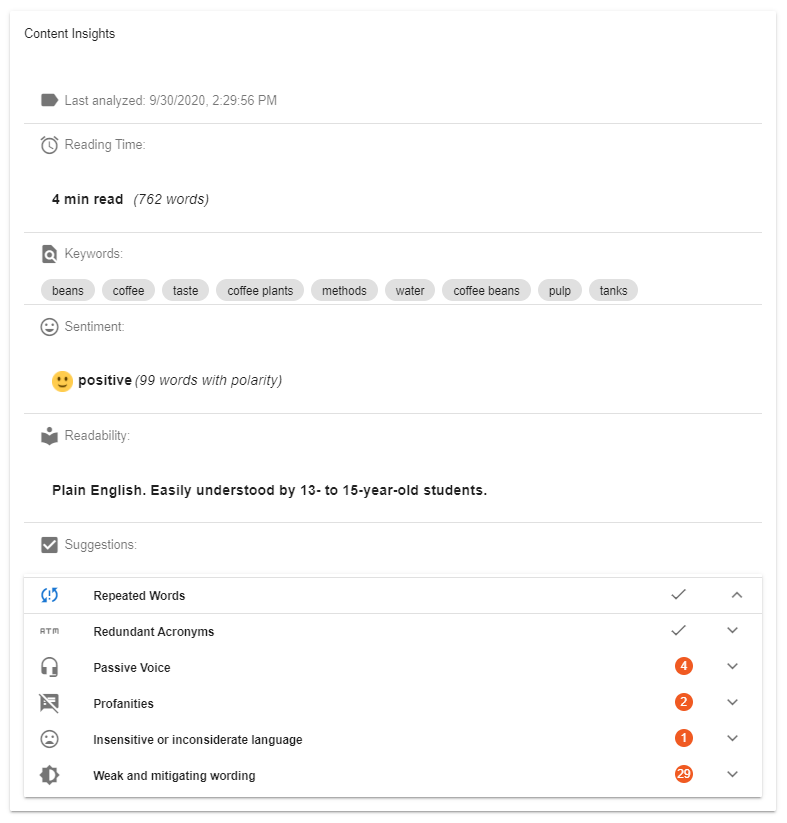

# Content Insights

[](https://stackoverflow.com/tags/kentico-kontent)


Content Insights custom element lets you analyze content from text and rich text elements residing inside your content item. It analyses basic content properties like reading time, readability, and sentiment. It also generates configurable number of keywords from the written content.
On top of that, the custom element offers suggestions on how to improve your content.



## Features

The element accesses content from all of the linked text & rich text elements, joins it together, and analyzes it. Natural language processor [retextjs](https://github.com/retextjs) is used for most of the analytics & suggestions.

## Notes on using the element

- Currently,  **english** is the only supported language.
- The element is capable of processing **rich text** elements, however, due to current limitations in the custom element API, the *Preview API key* is required to access this functionality. This also means, that the element can access the currently edited version of the rich text element only after the rich text value has been saved and it might take a short while for the changes to propagate.
- The element saves all of the basic metrics mentioned in the description above, however, the suggestions are not being saved at the moment
- You are free to analyze multiple text & rich text elements at once, however, if you choose to do so, the suggestions tab won't display line numbers next to the suggestions so you'd have to search for the occurrences yourself.

## Setup

1. Deploy the code to a secure public host

    - See [deploying section](#Deploying) for a really quick option

1. Follow the instructions in the [Kentico Kontent documentation](https://docs.kontent.ai/tutorials/develop-apps/integrate/integrating-your-own-content-editing-features#a-3--displaying-a-custom-element-in-kentico-kontent) to add the element to a content model.

    - The `Hosted code URL` is where you deployed to in step 1
    - Pass the necessary parameters as directed in the [JSON Parameters configuration](#configuring-the-custom-element) section of this readme.

## Deploying

Netlify has made this easy. If you click the deploy button below, it will guide you through the process of deploying it to Netlify and leave you with a copy of the repository in your account as well.

[](https://app.netlify.com/start/deploy?repository=https://github.com/Kentico/kontent-custom-element-content-insights)

## Configuring the Custom Element

You will need to add the custom element to a content type filling in the hosted code URL and the JSON parameters (see below for details). You will also need to allow the custom element to read the values of the elements you want to base keywords off of.

The JSON parameters required as as follows:

|Required | Name | Value | Description |
|---------| ---- | ----- | ----------- |
|* if using text elements|textElements|array| This is the array of text elements you want to have analyzed. **The specified elements must also be set as readable for the custom element** (_"Allow the custom element to read values of specific elements"_ section in custom element settings). |
|* if using rich text elements|richTextElements|array| This is the array of rich text elements you want to have analyzed. If you wish to read from rich text elements, you have to provide the previewApiKey |
|* if using rich text elements|previewApiKey|string| This is the access key for your [Kontent Delivery Preview API](https://docs.kontent.ai/reference/delivery-api#section/Production-vs.-Preview).|
|*|maxKeywords|int| This is the maximum number of keywords the element will generate. If the text is too short or the language processor is not able to find sufficient number of keywords, the element can potentially return less keywords than the specified value suggests.|
||Suggestions|array| This specifies categories of suggestions generated for the given content by the language processor. You can pick whatever combination you'd like from the provided list below in example. If you omit the suggestion property entirely, you'll automatically have access to all available suggestions. If you wish to omit suggestions all together, just set `"suggestions" : []`.|

```json
{
  "textElements": ["<YOUR TEXT ELEMENT1>"],
  "richTextElements": ["<YOUR RICH TEXT ELEMENT 1>"],
  "previewApiKey": "<YOUR PREVIEW API KEY>",
  "maxKeywords": 8,
  "suggestions" : [
        "repeated",
        "acronyms",
        "passive",
        "profanities",
        "insensitive",
        "weak"
    ]
}
```

## Developing

### Initial project setup

```console
npm install
```

### Compiles and hot-reloads for development

```console
npm run serve
```

### Compiles and minifies for production

```console
npm run build
```

### Lints and fixes files

```console
npm run lint
```

### Customize Vue CLI configuration

See [Vue CLI Configuration Reference](https://cli.vuejs.org/config/).

## Contributors

Originally contributed by [@RostaStriz](https://github.com/strizr)


